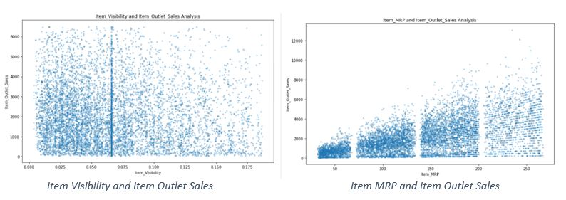
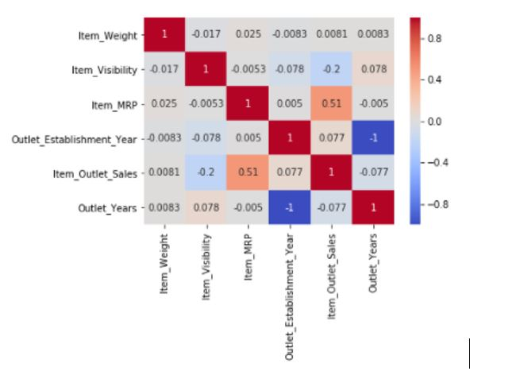

# BigMart-Sales-Prediction
## Business Context

Bigmart is a large supermarket chain, with stores all around the country. The data scientists at BigMart have collected 2013 sales data for 1559 products across 10 stores in different cities. Also, certain attributes of each product and store have been defined. 
The aim is to build a predictive model and find out the sales of each product at a particular store. This will help the management take decisions like which type of products to concentrate on at a particular store for increasing sales and so on.

## Objective
The aim is to build a predictive model and find out the sales of each product at a particular store. Using this model, BigMart will try to understand the properties of products and stores which play a key role in increasing sales.

This is a supervised machine learning problem with a target label as “Item_Outlet_Sales” Also since we are expected to predict a predict the sale price for a given product, it becomes a regression task.

## Dataset Information

Variable | Description
----------|--------------
Item_Identifier | Unique product ID
Item_Weight | Weight of product
Item_Fat_Content | Whether the product is low fat or not
Item_Visibility | The % of total display area of all products in a    store allocated to the particular product
Item_Type | The category to which the product belongs
Item_MRP | Maximum Retail Price (list price) of the product
Outlet_Identifier | Unique store ID
Outlet_Establishment_Year | The year in which store was established
Outlet_Size | The size of the store in terms of ground area covered
Outlet_Location_Type | The type of city in which the store is located
Outlet_Type | Whether the outlet is just a grocery store or some sort of supermarket
Item_Outlet_Sales | Sales of the product in the particulat store. This is the outcome variable to be predicted.

## Exploratory Data Analysis

## Outlier Detection and Treatment

Number of Outliers in Item_Weight = 0  
Number of Outliers in Item_Visibility = 99  
Number of Outliers in Item_MRP = 0  
Number of Outliers in Item_Outlet_Sales = 90  
Number of Outliers in Outlet_Years = 0  

So, we have 2 features with outliers present. We will be removing these outliers from our dataset.

### Before Outlier Treatment: 

### After Outlier Treatment: 

## Correlation Matrix

## Feature Engineering
1. Item Weight: The missing values were imputed by mean of Item weights for a particular Item Identifier  
2.Outlet Size: The missing values were imputed with mode (most frequent category) of Outlet Size for a particular Outlet Type (Grocery Store, Supermarket Type1, Supermarket Type2, Supermarket Type3)  
3. Items for which Item_Visibility was 0, was replaced with mean of Item_Visibility column  
4. The categories in Item_Fat_Content were renamed.  
5. Categorical columns were converted to numeric using One-Hot Encoding.  

### Creation of New Attributes:
1.  A new feature called “New_Item_Type” was created by extracting the type of product from the Item_Identifier. The categories were Food, Non-Consumable and Drinks.

2. A new feature called “Outlet_Years” was created from “Outlet Establishment Year”. As the data was collected in 2013, the feature was created as,
Outlet_Years= 2013 – Outlet_Establishment_Year
This will give meaningful data when fed to the model for better accuracy.

## Model Training and Evaluation:
The ML models trained were:
1. Linear Regression  
2. Ridge Regression  
3. Lasso Regression  
4. Decision Tree Regressor  
5. Random Forest Regressor  

Random Forest Regressor gave the best results:

Model Report  
MSE: 0.18512155196314878  
CV Score: 0.28207932047494977  

### Feature Importances:

